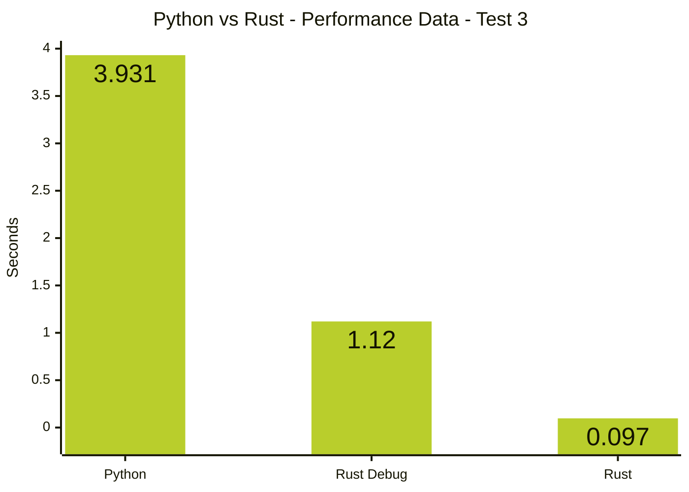

# Python vs Rust Performance
This watersort solve has now been implemented in two languages: Python and Rust. It was created originally in Python, and core pieces of functionality have been ported to Rust while preserving interoperability and code structure as the original Python implementation.

We will benchmark equivalent output from both programs and compare their performance.

**Percent Faster Calculation**

To measure how much faster Rust is compared to Python, we compute the relative speedup by comparing their average execution times. Specifically, we divide the Python runtime by the Rust runtime to determine how many times faster Rust is, then subtract 1 to convert that ratio into a percentage increase in speed.

In mathematical terms, the formula is:

$$\text{Percent Faster} = \left(\frac{T_{\text{Python}}}{T_{\text{Rust}}} - 1\right) \times 100$$

Here, $T_{\text{Python}}$ and $T_{\text{Rust}}$ represent the average execution times of the Python and Rust implementations, respectively. This expresses the performance improvement as a percentage relative to Rust’s runtime.


## Test 1: Complete A Game With Commands
In this test, each program will read in moves from the command line. Each move will be valid. The program will apply the move, print out the moves and new game state, and then prompt for the next input. When the game is completed, the program will terminate.

The results compare the Total time in seconds.

Completed at commit: f7324e78ff812d1171d79e9a1cddfcf1fc4a4e90

**Average Extraction**
```shell
awk '{ sum += $(NF-1); count++ } END { print sum / count }' results.txt
```

```shell
for file in performance_testing/results/**/*.txt; do
  avg=$(awk '{ sum += $(NF-1); count++ } END { if (count) print sum / count }' "$file")
  echo "$file: $avg"
done
```

```shell
read "test?Test number: "
read "executions?Num executions: "
echo "| Execution | Trials | Python Avg | Rust Debug Avg | % Faster | Rust Avg | % Faster |"
echo "|-----------|--------|------------|----------------|----------|----------|----------|"
for i in {1..$executions}; do
  py_file="performance_testing/results/test$test/python${i}.txt"
  rd_file="performance_testing/results/test$test/rust-debug${i}.txt"
  rs_file="performance_testing/results/test$test/rust${i}.txt"

  py_avg=$(awk '{s+=$(1);c++} END{if(c) print s/c}' "$py_file")
  rd_avg=$(awk '{s+=$(1);c++} END{if(c) print s/c}' "$rd_file")
  rs_avg=$(awk '{s+=$(1);c++} END{if(c) print s/c}' "$rs_file")

  trials=$(cat "$py_file" | wc -l)
  percent_d=$(awk -v p="$py_avg" -v r="$rd_avg" 'BEGIN{ printf "%.1f", (p/r - 1) * 100 }')
  percent_r=$(awk -v p="$py_avg" -v r="$rs_avg" 'BEGIN{ printf "%.1f", (p/r - 1) * 100 }')

  echo "| $i | $trials | $py_avg | $rd_avg | $percent_d% | $rs_avg | **$percent_r%** |"
done
```

### Independent

**Python**
```shell
rm results.txt
for i in {1..100}; do
  echo "Python trial $i"
  (time python src/python/watersort.py 100 < performance_testing/ans-100.txt > /dev/null) 2>> results.txt
  sleep 1
done
mv results.txt performance_testing/results/test1/pythonN.txt
```

**Rust**
```shell
rm results.txt
cargo build
for i in {1..100}; do
  echo "Rust trial $i"
  (time ./target/debug/watersort 100 < performance_testing/ans-100.txt > /dev/null) 2>> results.txt
  sleep 1
done
cp results.txt performance_testing/results/test1/rustN.txt
```

**Results**
| Execution | Python Avg | Rust Avg | % Faster |
|---|---------|---------|--------|
| 1 | 0.08491 | 0.01377 | 516.6% |
| 2 | 0.11936 | 0.02336 | 411.0% |

### Interleaved

**Code**
```zsh
read "execution?Execution Number: "
cargo build
for i in {1..500}; do
  echo "Trial $i"
  (time python src/python/watersort.py 100 < performance_testing/ans-100.txt > /dev/null) 2>> "performance_testing/results/test1/python$execution.txt"
  (time ./target/debug/watersort 100 < performance_testing/ans-100.txt > /dev/null) 2>> "performance_testing/results/test1/rust$execution.txt"
done
```

**Results**

| Execution | Python Avg | Rust Avg | % Faster |
|---|---------|---------|--------|
| 3 | 0.10106 | 0.01506 | 571.0% |
| 4 | 0.096066 | 0.009776 | 882.7% |

### Test 1 - Overall Results

| Execution | Python Avg | Rust Avg | % Faster | Type |
|---|---------|---------|------------|-------------|
| 1 | 0.08491 | 0.01377 | **516.6%** | Independent |
| 2 | 0.11936 | 0.02336 | **411.0%** | Independent |
| 3 | 0.10106 | 0.01506 | **571.0%** | Interleaved |
| 4 | 0.096066 | 0.009776 | **882.7%** | Interleaved |

Therefore, Rust is roughly **4×–9× faster** depending on the run.

## Test 2: Complete A Game with Mode Processing

Nearly the same as Test 1, except mode switching functionality was added to the Rust solver.

Completed at commit: 69096b9609cf4a7484db7eac39f9a7e660a12821

**Code**
Directly Interleaved:
```zsh
read "execution?Execution Number: "
read "trials?Num Trials: "
cargo build
for i in {1..$trials}; do
  echo "Trial $i"
  (time python src/python/watersort.py < performance_testing/ans-100.txt > /dev/null) 2>> "performance_testing/results/test2/python$execution.txt"
  (time ./target/debug/watersort < performance_testing/ans-100.txt > /dev/null) 2>> "performance_testing/results/test2/rust$execution.txt"
done
echo "Completed execution $execution"
```

Spaced out:
```zsh
read "execution?Execution Number: "
read "trials?Num Trials: "
cargo build
for i in {1..$trials}; do
  echo "Trial $i"
  (time python src/python/watersort.py < performance_testing/ans-100.txt > /dev/null) 2>> "performance_testing/results/test2/python$execution.txt"
  (time ./target/debug/watersort < performance_testing/ans-100.txt > /dev/null) 2>> "performance_testing/results/test2/rust$execution.txt"
  sleep 1
  (time ./target/debug/watersort < performance_testing/ans-100.txt > /dev/null) 2>> "performance_testing/results/test2/rust$execution.txt"
  (time python src/python/watersort.py < performance_testing/ans-100.txt > /dev/null) 2>> "performance_testing/results/test2/python$execution.txt"
  sleep 1
done
echo "Completed execution $execution"
```

**Results**

| Execution | Python Avg | Rust Avg | % Faster | Interleaving |
|---|---------|---------|--------------|-------------|
| 1 | 0.059178 | 0.006422 | **821.5%** | Back-to-back |
| 2 | 0.06104 | 0.00684 | **792.4%** | Back-to-back |
| 3 | 0.06613 | 0.006712 | **885.3%** | Back-to-back |
| 4 | 0.060876 | 0.006349 | **858.8%** | Back-to-back |
| 5 | 0.08564 | 0.01782 | **380.6%** | Spaced out |
| 6 | 0.084225 | 0.0149 | **465.3%** | Spaced out |

## Test 3

Tests the time to BFS solve a simple level (`2023/dec3`).

Completed at commit: 8082824ea8ebf0435266b440df54016454ba1453

**Code**

Directly interleaved:
```shell
read "execution?Execution Number: "
read "trials?Num Trials: "
cargo build
cargo build --release
for i in {1..$trials}; do
  echo "Trial $i"
  (/usr/bin/time python watersort.py 2023/dec3 bfs > /dev/null) 2>> "performance_testing/results/test3/python$execution.txt"
  (/usr/bin/time ./target/debug/watersort 2023/dec3 bfs > /dev/null) 2>> "performance_testing/results/test3/rust-debug$execution.txt"
  (/usr/bin/time ./target/release/watersort 2023/dec3 bfs > /dev/null) 2>> "performance_testing/results/test3/rust$execution.txt"
done
echo "Completed execution $execution"
```

Spaced out:
```shell
read "execution?Execution Number: "
read "trials?Num Trials: "
cargo build
cargo build --release
for i in {1..$trials}; do
  echo "Trial $i"
  sleep 1
  (/usr/bin/time python watersort.py 2023/dec3 bfs > /dev/null) 2>> "performance_testing/results/test3/python$execution.txt"
  sleep 1
  (/usr/bin/time ./target/debug/watersort 2023/dec3 bfs > /dev/null) 2>> "performance_testing/results/test3/rust-debug$execution.txt"
  sleep 1
  (/usr/bin/time ./target/release/watersort 2023/dec3 bfs > /dev/null) 2>> "performance_testing/results/test3/rust$execution.txt"
done
echo "Completed execution $execution"
```

Output Generation:
```shell
# Generation
python watersort.py 2023/dec3 bfs > "performance_testing/results/test3/python-out.txt"
./target/debug/watersort 2023/dec3 bfs > "performance_testing/results/test3/rust-debug-out.txt"
./target/release/watersort 2023/dec3 bfs > "performance_testing/results/test3/rust-out.txt"

# Inspection
cd performance_testing/results/test3
cat *-out.txt
git diff --no-index rust-debug-out.txt rust-out.txt
# -- The same, except for the execution time
git diff --no-index python-out.txt rust-out.txt
git diff --no-index python-out.txt rust-out.txt --word-diff-regex='\w+|[^[:space:]]'
# -- Same solution, different format of stats, slight variation in color printing
# -- The rust version is executing 50-60% of the iterations
```

**Output Comparison**

The rust debug & release output is exactly the same, save for the major discrepancy in execution time.

The printed vials are exactly the same in all three versions.

The produced sequence of moves are identical between all three versions.
The rust versions appear to have an off-by-one error in reporting their own depth internally, but the printed moves are correct.

There are minor differences in styling the printed moves between the python and rust versions.
The python version prints out the color code only, but the rust version prints out the name of the color.

The rust version appears to be counting only 50-60% of the iterations/partial game states/dead ends compared to the python version.
This is likely due to a subtle difference in the searching algorithm, but does not account for the 5000%+ increase.

**Results**

| Execution | Trials | Python Avg | Rust Debug Avg | % Faster | Rust Avg | % Faster | Interleaving |
|-----------|--------|------------|----------------|----------|----------|----------|--------------|
| 1 |       10 | 3.931 | 1.12 | 251.0% | 0.097 | **3952.6%** | Back-to-back |
| 2 |       25 | 3.8568 | 1.0856 | 255.3% | 0.0852 | **4426.8%** | Back-to-back |
| 3 |      100 | 3.8498 | 1.0715 | 259.3% | 0.0736 | **5130.7%** | Back-to-back |
| 4 |       10 | 3.929 | 1.15 | 241.7% | 0.109 | **3504.6%** | Spaced out |
| 5 |       20 | 3.9385 | 1.1 | 258.0% | 0.104 | **3687.0%** | Spaced out |
| 6 |      100 | 3.9039 | 1.1146 | 250.3% | 0.1005 | **3784.5%** | Spaced out |



## Appendix A: Shell Reference

A generic loop for repeating a command 10 times with a delay.
```shell
for i in {1..10}; do
  {command}
  sleep 2
done
```
